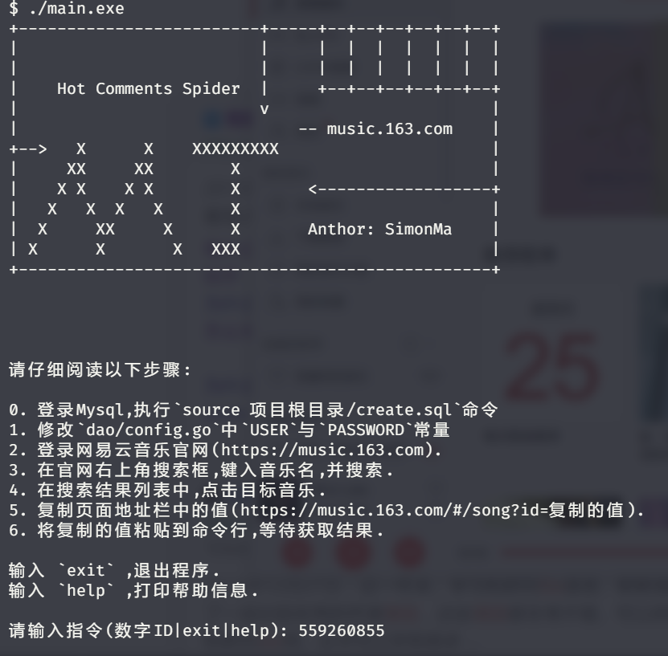
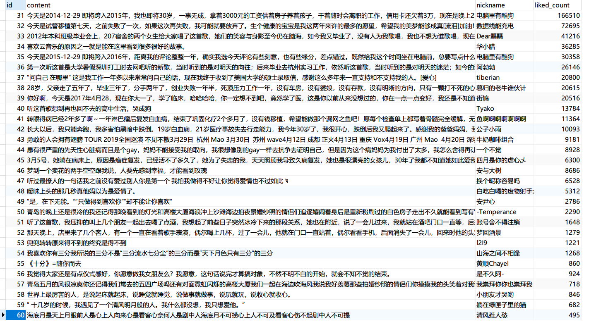

# 网易云音乐热评爬虫

 

## 💡简介

最近迷上了刷网易云热评,感觉每一条热评都代表着一个故事.

对于我这种逐渐木化的直男来说,是一种特别的"营养".

爬取网站: [网易云音乐](<https://music.163.com/>)

## 📃技术

使用 `golang` 作为开发语言, `gorm` 作为数据库映射层, 结合 `channel+goruntine` 实现了多并发.

## ✨截图

## 🎉使用

1. 克隆项目到本地

2. 登录Mysql,执行`source 项目根目录/create.sql`命令

3. 修改`dao/config.go`中`USER`与`PASSWORD`常量

4. 登录网易云音乐官网(https://music.163.com).

5. 在官网右上角搜索框,键入音乐名,并搜索.

6. 在搜索结果列表中,点击目标音乐.

7. 复制页面地址栏中的值(https://music.163.com/#/song?id=复制的值).

8. 将复制的值粘贴到命令行,等待获取结果.

## 🌞协议

LGPL-3.0

## 🔔声明

本项目仅做技术交流使用，任何人无论以何种形式将其用在任何地方由此引发的各种问题均与本人无关。